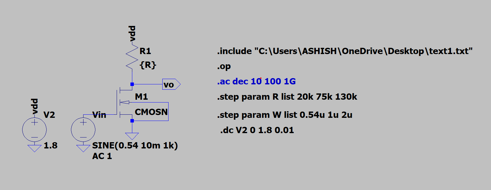
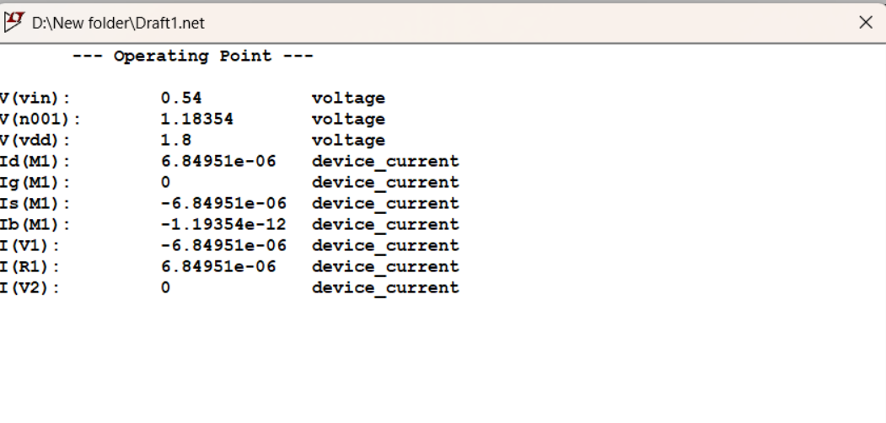
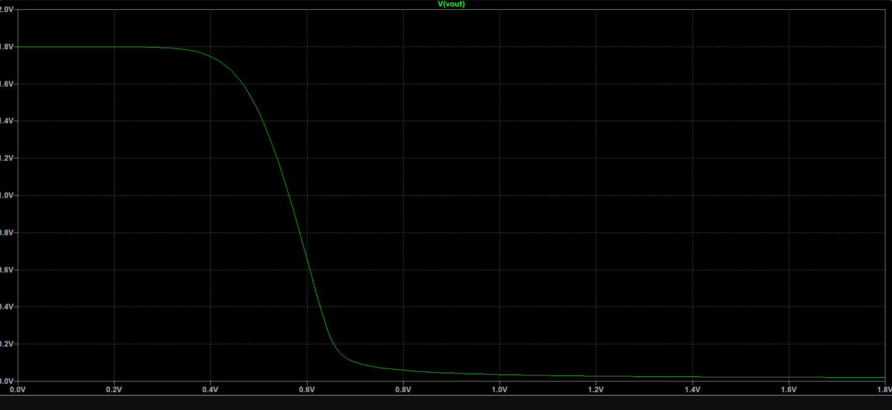
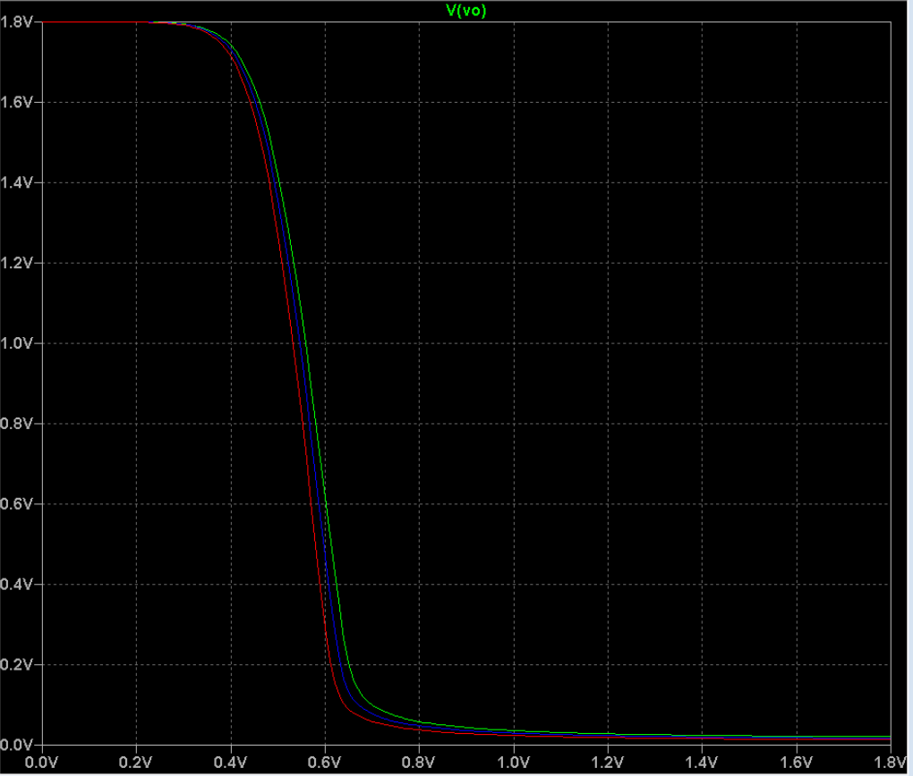
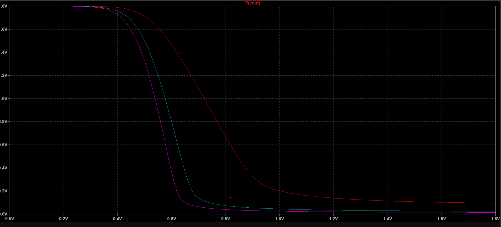
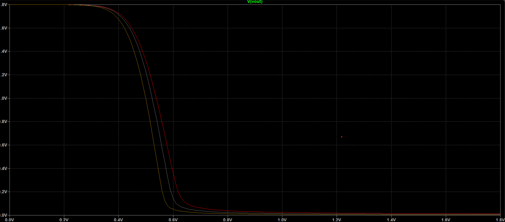
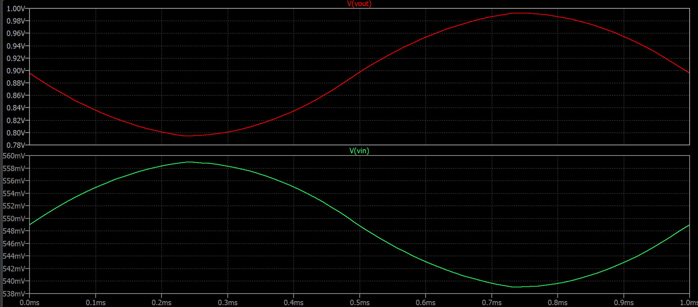
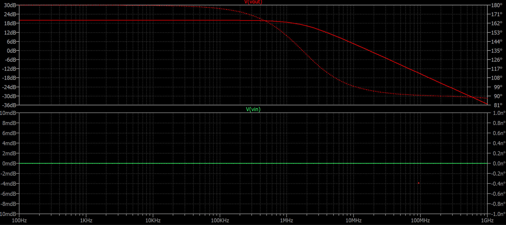

# CS Amplifier Analysis using LTSpice

## Aim
To perform DC, Transient, and AC analysis of a Common Source (CS) amplifier using LTSpice and extract key performance parameters.

---

## Components
- NMOS transistor  
- Resistors  
- DC supply (VDD)  
- Input voltage source  
---

## Theory
A **MOSFET (Metal-Oxide-Semiconductor Field-Effect Transistor)** controls current using an electric field and offers high input impedance.

A **Common Source (CS) amplifier** uses the source terminal as the common reference. It provides voltage gain and introduces a 180° phase shift between input and output.

## Procedure
1. Design the CS amplifier circuit using LTSpice.
2. Connect the required components as per the circuit diagram.
3. Perform DC analysis to determine the biasing conditions.
4. Perform transient analysis to study the time-domain response.
5. Perform AC analysis to extract gain and frequency response characteristics.
6. Record observations and extract relevant parameters.
   
## Circuit

---

# DC Analysis

## Operating Point

From simulation:

- **Drain Current (ID)** = 6.85 µA  
- **Output Voltage (Vout)** ≈ 0.9 V  

Midpoint bias condition:

Vout ≈ VDD / 2 = 0.9 V  

Saturation check:

VDS > (VGS − VT)

Since VDS is much greater than (VGS − VT), the MOSFET operates in saturation.

**Q-point:**  
( VDS ≈ 0.9 V , ID ≈ 6.85 µA )

---
## DC Sweep

### Perform DC Sweep Analysis
1. Go to:
   Simulate → Edit Configure Analysis → DC Sweep
2. Select:
   - Sweep Variable: Voltage source (Vin)
   - Start: 0 V
   - Stop: 1.8 V
   - Step: 0.01 V
3. Run simulation.
4. Plot V(out) vs Vin.
5. Identify:
   - Steepest curve (for different RD values).
6. Choose midpoint:
   Vout ≈ VDD/2 = 0.9 V
7. Note corresponding Vin → DC Offset (0.549 V).

---

## Effect of Parameters

### Varying RD
- Increasing RD increases gain  
- Bandwidth decreases  
- Demonstrates gain–bandwidth tradeoff  

### Varying W
- Increasing transistor width increases ID  
- Transconductance (gm) increases  
- Gain increases  
- Q-point shifts

---

# Transient Analysis

### Input Signal
SIN(0.549 10m 1k)

- DC offset = 0.549 V  
- Amplitude = 10 mV  
- Frequency = 1 kHz  

### Results
- Output is inverted (180° phase shift)  
- No clipping observed  
- Output swing ≈ 0.9 V ± 0.316 V  

Linear gain (from AC result ≈ 30 dB):

Av ≈ 31.6  

The amplifier operates properly in the active region.

---

# AC Analysis

AC Command:

.ac dec 100 1 1G

### Key Results

- Midband gain ≈ 20 (from graph)  
- High-frequency cutoff ≈ 1 MHz  
- Inverting phase response confirmed  

---

## Important Calculations

### Transconductance

gm = 2ID / (VGS − VT)  

gm ≈ 0.138 mS  

### Theoretical Gain

Av = −gm × RD  

(Slight difference from simulation due to device model and parasitics.)

### High-Frequency Cutoff

fH = 1 / (2πRC)

fH ≈ 1 MHz  

Bandwidth ≈ 1 MHz  

---

# Results

- Proper biasing achieved with ID = 6.85 µA  
- Q-point ≈ (0.9 V, 6.85 µA)  
- Voltage gain ≈ 20  
- Cutoff frequency ≈ 1 MHz  
- Stable operation due to voltage divider biasing  

---

# Key Parameters of CS Amplifier

- **Voltage Gain (Av):** Output-to-input voltage ratio  
- **Input Impedance (Zin):** Resistance seen at input  
- **Output Impedance (Zout):** Resistance seen at output  
- **Cutoff Frequency:** Frequency where gain drops by 3 dB  
- **Phase Shift:** 180° inversion between input and output  

---

## Conclusion

The CS amplifier was successfully analyzed using DC, Transient, and AC simulations. Proper biasing ensured stable operation in saturation. Increasing transistor width increases drain current and gain. In integrated circuits, active devices often replace passive resistive elements for improved performance and area efficiency.
